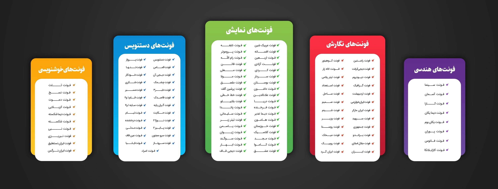

یک مجموعه فونت رایگان آماده کردم. مزیتش اینه که بر اساس تایپ فیسشون دسته بندی شده. اینطوری راحت تر میتونید فونت مناسب رو پیدا کنید:

  
    
    
    
    
    
  

  
  
  
  
  


 

از لینک زیر میتونید دانلود کنید:


  


 


برای مشاهده پیشنمایش فونت ها هم میتونید از نرم افزار [FONTBASE](https://fontba.se/) استفاده کنید. اینطوری خیلی راحت میتونید فونت مدنظرتون رو انتخاب کنید. از نوار پایین هم می تونید متن دلخواه خودتون رو بنویسید تا نمایش بده. از بخش تنظیمات هم میتونید متن پیشفرض رو تنظیم کنید.

بعد از نصب نرم افزار. روی گزینه Add که پایین سمت چپ قرار گرفته کلیک کنید. گزینه Folder رو انتخاب کرده و فولدر حاوی فونت ها رو سلکت کنید.
